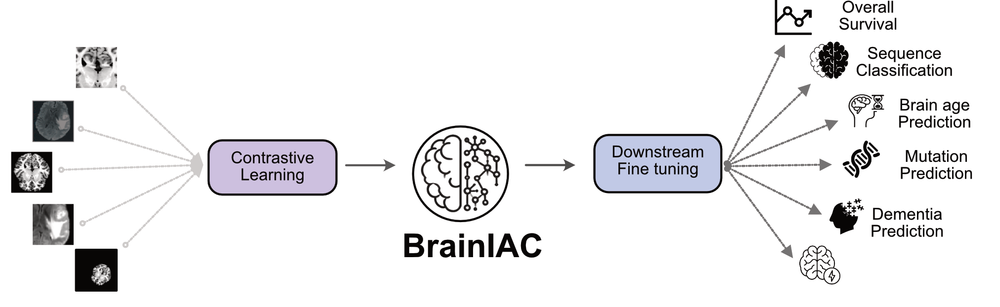

# BrainIAC: A foundation model for generalized Brain MRI analysis

<p align="center">
  
</p>

## Overview

This repository provides the model and implementation details for BrainIAC, a vision foundation model for generalized Brain MRI analysis. BrainIAC has been trianed using SimCLR on 32,000 brian MR scans. The foundation model has been downstream validated across 6 different tasks with wide ranging endpoint difficulties - 
- MR Sequence Classification
- Brain age prediction
- IDH Mutation classification (IDH Mutant Vs Wildtype)
- Overall survival for GBM subjects
- Mild Cognitive impairment (MCI) classification (MCI Vs Healthy Control)
- Time to stroke onset prediction

The core of BrainIAC is a 3D ResNEt50 model, which takes in complete 3D Brain MR volume to generate robust adaptable representations that are downstream transferable. For more insights checkout the preprint [Here]([https://website-name.com)](https://www.medrxiv.org/content/10.1101/2024.12.02.24317992v1)

## Key Features

- **Radiomics Feature Extraction**: Extract 2048-dimensional feature vectors from brain MRI scans
- **Saliency Map Visualization**: Generate saliency maps to visualize model attention
- **Downstream Task Train/Infer**: Infer or train the downstream models
- **Use as a library**: Run and build on top of BrainIAC and the downstream models via python library 
- **Plug and play docker**: Plug and play with BrainIAC and downstream models via docker

## Quick Start

### Installation

```bash
# Clone the repository
git clone https://github.com/your-username/brainiac.git
cd brainiac

# Create conda environment
conda create -n brainiac python=3.9
conda activate brainiac

# Install dependencies
pip install -r requirements.txt
```

### Basic Usage

```python
from load_brainiac import load_brainiac

# Load pre-trained model
model = load_brainiac("path/to/checkpoint", device="cuda")

# Extract features
features = model(input_scan)
```

## 📊 Feature Extraction

Extract meaningful features from brain MRI scans:

```bash
python get_brainiac_features.py \
    --checkpoint /path/to/model/checkpoint \
    --input_csv input_scans.csv \
    --output_csv features.csv \
    --root_dir /path/to/data
```

## 🎯 Saliency Maps

Generate interpretable saliency maps:

```bash
python get_brainiac_saliencymap.py \
    --checkpoint /path/to/model/checkpoint \
    --input_csv input_scans.csv \
    --output_dir /path/to/output \
    --root_dir /path/to/data
```

## 📋 Model Architecture

BrainIAC is built on a modified ResNet-50 architecture:
- Input: 3D MRI scans (1 channel)
- Backbone: Modified ResNet-50 with 3D convolutions
- Output: 2048-dimensional feature vector
- Additional: Guided backpropagation for saliency maps

## 🔬 Research Applications

BrainIAC has been successfully applied to:
- Disease classification
- Longitudinal analysis
- Biomarker discovery
- Treatment response prediction

## 📚 Citation

If you use BrainIAC in your research, please cite:

```bibtex
@article{brainiac2024,
  title={BrainIAC: A Foundation Model for Generalized Brain MRI Analysis},
  author={Your Team},
  year={2025}
}
```


## 📄 License

BrainIAC is released under the MIT License. See [LICENSE](LICENSE) for details.

## 🙏 Acknowledgments

We thank our collaborators and the open-source community for their valuable contributions.


---


