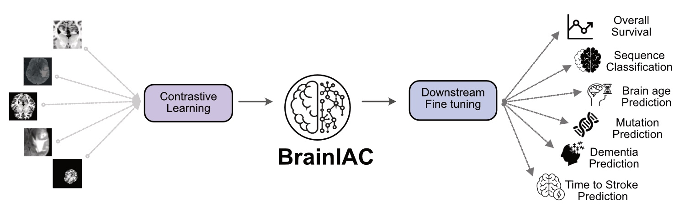

# BrainIAC: A foundation model for generalized Brain MRI analysis

<p align="center">
  
</p>

## Overview

BrainIAC is a vision foundation model for generalized Brain MRI analysis, trained using SimCLR on 32,000 brain MR scans. The model has been validated across 6 different downstream tasks:

- MR Sequence Classification
- Brain age prediction
- IDH Mutation classification 
- Overall survival for GBM subjects
- Mild Cognitive impairment (MCI) classification
- Time to stroke onset prediction

For detailed information, check out our [preprint](https://www.medrxiv.org/content/10.1101/2024.12.02.24317992v1).

## Installation

```bash
# Clone and setup
git clone https://github.com/DivyanshuTak/BrainIAC.git
cd brainiac

# Create conda environment
conda create -n brainiac python=3.9
conda activate brainiac
pip install -r requirements.txt
```

## Model Checkpoints

Download BrainIAC and downstream model checkpoints: [Model Checkpoints](https://www.dropbox.com/scl/fo/i51xt63roognvt7vuslbl/AG99uZljziHss5zJz4HiFis?rlkey=9w55le6tslwxlfz6c0viylmjb&st=r5nyejyo&dl=0) and place them in the [checkpoints](./src/BrainIAC/checkpoints) directory.

## Quick Start

See [quickstart.ipynb](./src/BrainIAC/quickstart.ipynb) to get started of how to preprocess data, load BrainIAC to extract features, generate and visualize saliency maps, and run inference on downstream tasks. We provide data samples from publicly available [UPENN-GBM](https://www.cancerimagingarchive.net/collection/upenn-gbm/) [License](https://creativecommons.org/licenses/by/4.0/) (with no modifications to the provided preprocessed images) and the [Pixar](https://openneuro.org/datasets/ds000228/versions/1.1.1)  [License](https://creativecommons.org/public-domain/cc0/) dataset in the [sample_data](src/BrainIAC/data/sample/processed/) directory. The corresponding csv files with ground truth labels are also made available in [csvs](src/BrainIAC/data/csvs) directory.


## Train Downstream Models

- [Brain Age Prediction](./src/BrainIAC/Brainage/README.md)
- [IDH Mutation Classification](./src/BrainIAC/IDHprediction/README.md)
- [MCI Classification](./src/BrainIAC/MCIclassification/README.md)
- [Overall Survival Prediction](./src/BrainIAC/OverallSurvival/README.md)
- [Sequence Classification](./src/BrainIAC/SequenceClassification/README.md)
- [Time to Stroke Prediction](./src/BrainIAC/timetostroke/README.md)

## Citation

```bibtex
@article{tak2024brainiac,
    title={BrainIAC: A Foundation Model for Generalized Brain MRI Analysis},
    author={Tak, Divyanshu and others},
    journal={medRxiv},
    year={2024},
    doi={10.1101/2024.12.02.24317992}
}
```

## License

BrainIAC is released under the CC BY-NC License. See [LICENSE](LICENSE) for details.


